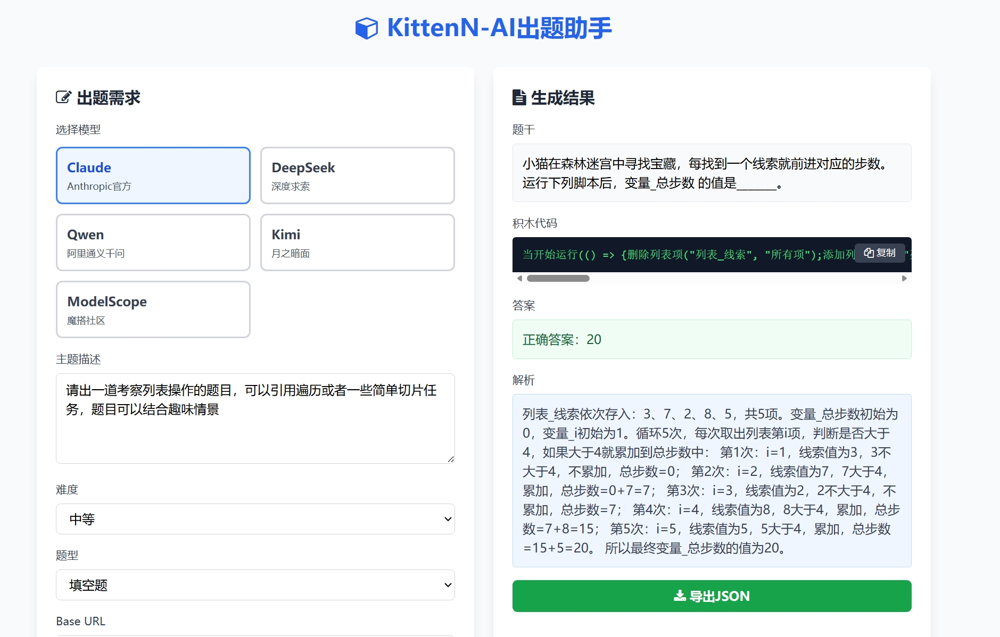

# Kitten-N AI 编程出题助手

基于 Claude AI 的 Scratch 风格积木编程出题工具，专为少儿编程教育设计。

> This project is an AI question generator assistant based on the KittenN block programming platform



## 项目简介

这是一个智能出题系统，能够根据指定的知识点、难度和题型，自动生成符合积木编程语法规范的高质量编程题目。适用于编程教育机构、教师和内容创作者。

## 核心特性

- **智能生成**：基于 Claude AI 自动生成题目
- **语法规范**：严格遵循 11 类积木语法规范
- **多种题型**：支持填空题、单选题、多选题、问答题
- **难度分级**：简单、中等、拔高三个难度等级
- **即开即用**：无需安装，双击 HTML 文件即可使用
- **本地存储**：API 配置自动保存在浏览器

## 项目结构

```
积木语法测试/
├── 单题目/                    # 单题目生成版本
│   ├── AI出题工具.html        # 主程序（单题目）
│   ├── 启动工具.bat           # 本地服务器启动脚本
│   ├── 使用说明.md            # 使用文档
│   ├── 系统提示词配置.md      # AI 提示词配置
│   ├── 案例库.md              # 题目案例
│   └── Rules/                 # 积木语法规范文档
├── 多题目/                    # 批量生成版本
│   ├── AI出题工具.html        # 主程序（多题目）
│   ├── 系统提示词配置.md      # AI 提示词配置
│   ├── 案例库.md              # 题目案例
│   └── Rules/                 # 积木语法规范文档
└── README.md                  # 本文件
```

## 快速开始

### 方法 1：直接使用（推荐）

1. 下载项目文件
2. 双击 `单题目/AI出题工具.html` 或 `多题目/AI出题工具.html`
3. 输入 API Base URL 和 API Key
4. 开始生成题目

### 方法 2：本地服务器

1. 确保已安装 Python
2. 双击 `单题目/启动工具.bat`
3. 浏览器自动打开工具页面

## 使用说明

### 1. 配置 API

首次使用需要配置：
- **Base URL**：Claude API 地址（如 `https://api.anthropic.com`）
- **API Key**：从 Anthropic 或中转服务商获取

配置会自动保存在浏览器本地存储中。

### 2. 生成题目

1. 输入题目主题（如"循环与变量"）
2. 选择难度等级（简单/中等/拔高）
3. 选择题型（填空/单选/多选/问答）
4. 点击"生成题目"按钮
5. 等待 AI 生成结果

### 3. 导出题目

生成的题目以 JSON 格式展示，可直接复制使用。

## 积木语法规范

工具支持以下 11 类积木语法：

1. **Events（事件）**：程序入口和事件触发
2. **Motions（动作）**：角色移动和旋转
3. **Control（控制）**：循环、条件判断
4. **Sensing（侦测）**：碰撞检测、键盘输入
5. **Operation（运算）**：数学运算、逻辑判断
6. **Variable（变量）**：变量定义和操作
7. **List（列表）**：列表操作
8. **Pen（画笔）**：绘图功能
9. **Sound（声音）**：音频播放
10. **Looks（外观）**：角色外观控制
11. **Data（数据）**：数据处理

详细语法规范请查看 `Rules/` 目录。

## 题目示例

### 填空题示例

```json
{
  "topic": "循环逻辑",
  "difficulty": "简单",
  "question_type": "填空题",
  "content": {
    "stem": "运行下列脚本，角色最终的X坐标是_______。",
    "code_block": "当开始运行(() => {设置x坐标(0);重复循环(5, () => {改变x坐标(\"增加\", 2);});});"
  },
  "answer": "正确答案：10",
  "analysis": "初始X坐标为0，循环5次，每次增加2，最终X坐标为：0 + 2×5 = 10。"
}
```

## 自定义配置

如需修改 AI 出题规则：

1. 编辑 `系统提示词配置.md`
2. 修改语法规范、难度定义或题型要求
3. 将修改后的内容同步到 HTML 文件的 `buildPrompt` 函数
4. 刷新页面测试

## 技术栈

- **前端**：纯 HTML + JavaScript
- **样式**：Tailwind CSS（CDN）
- **AI 模型**：Claude 3.5 Sonnet
- **API**：Anthropic Claude API

## 系统要求

- Windows 7 及以上（或其他操作系统）
- 现代浏览器（Chrome、Edge、Firefox、Safari）
- 无需安装任何软件

## 常见问题

### Q: 提示 "failed to fetch"

检查以下几点：
1. Base URL 是否正确
2. API Key 是否有效
3. 网络连接是否正常
4. 是否需要配置代理

### Q: 生成的代码不符合规范

修改 `系统提示词配置.md`，调整语法规范和约束条件。

### Q: 无法保存配置

浏览器可能禁用了本地存储，请检查浏览器隐私设置。

## 版本历史

- **v1.0**（2025-02-04）：初始版本
  - 支持单题目和批量生成
  - 11 类积木语法规范
  - 4 种题型，3 个难度等级

## 许可证

本项目仅供学习和教育用途。

## 联系方式

如有问题或建议，请通过 GitHub Issues 反馈。

---

**开发日期**：2025 年 2 月
**最后更新**：2025 年 2 月 9 日
